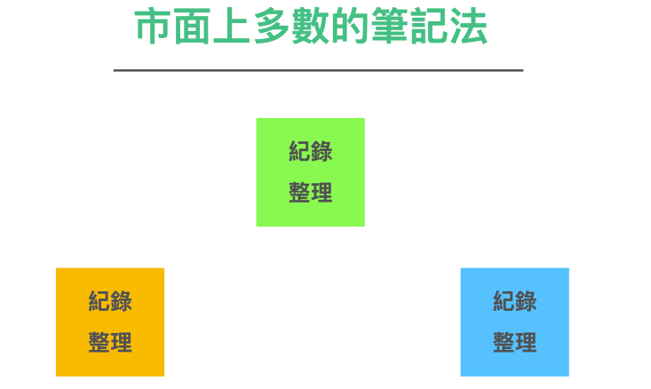
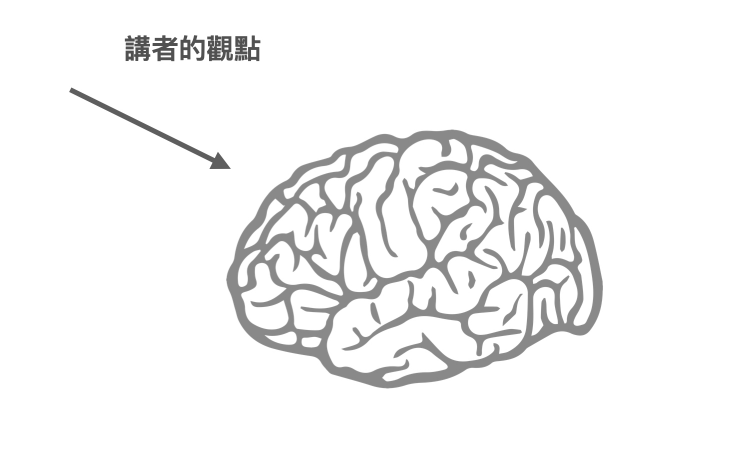
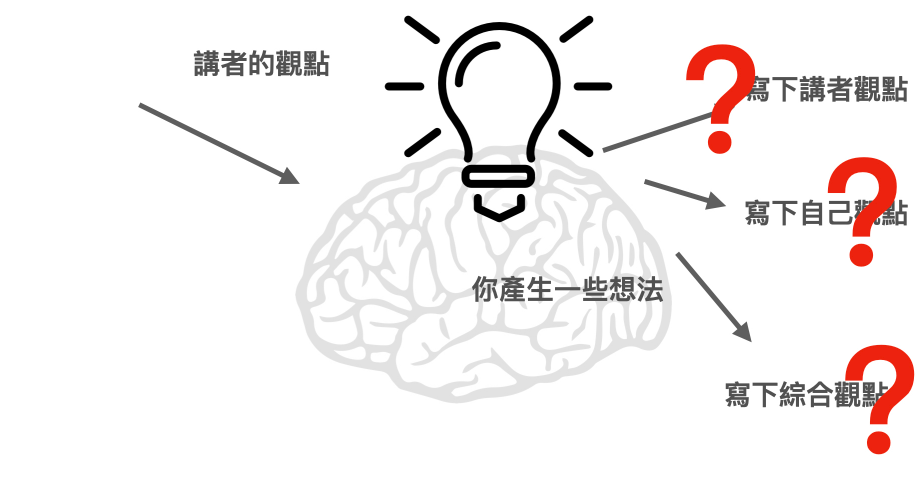
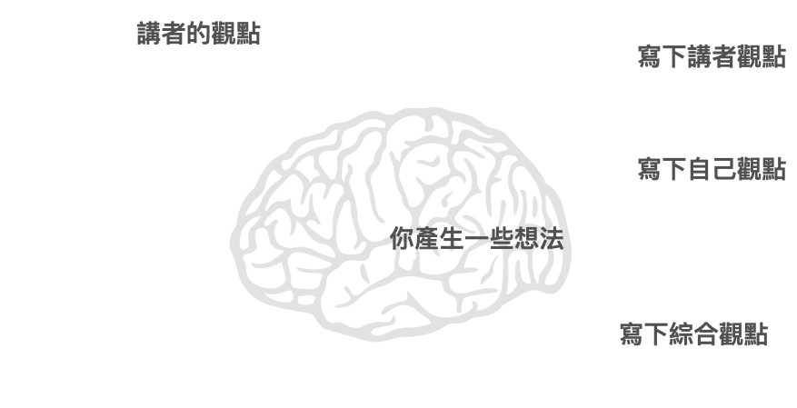
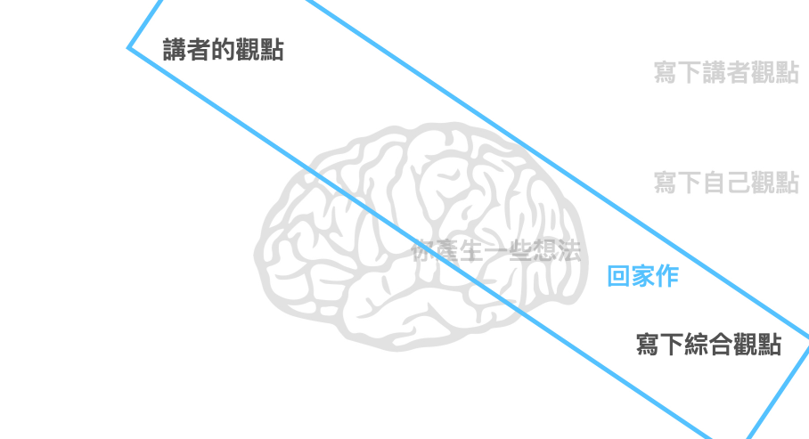
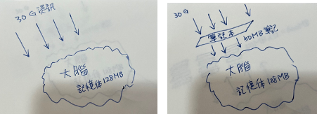
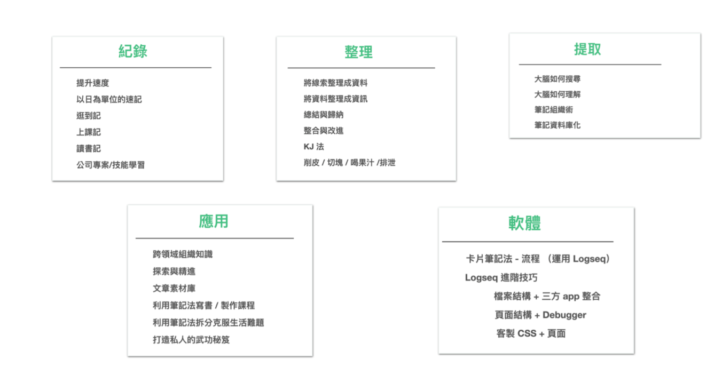

筆記，是人類獲取和記錄資訊的基石，無論在學習或工作中，都扮演著重要的角色。然而，筆記的效率和成效卻是一個普遍存在的問題。

無論是學生抄寫課堂筆記，還是職場上記錄會議內容，人們常常面臨筆記雜亂、找不到重要資訊、或是靈感消失無蹤等困難。

作為一名學習專家，我也曾經為這個問題困擾許久。我曾經試過許多不同的筆記方法和軟體，從最早的手寫筆記本，到後來的Word+資料夾，再到使用Evernote收集筆記，甚至嘗試過心智圖和卡片筆記法。

然而，這些方法和軟體都無法完全解決我在筆記領域中遇到的種種問題。

直到一個契機。當時的我正在研究一套現代筆記軟體，並想舉辦功能讀書會。在會前，我進行了一次意見調查。當時，原本我心中的假想，是大家會對這套這軟體裡面一些細部好奇。

然而，在收到問卷的回饋後，我卻相當意外。大家對於這套軟體幾乎沒什麼疑問。大家所提出的問題，竟然多半是傳統筆記方法所遇到的困境。

這讓我意識到，在筆記流程上。過去似乎我們都有共同錯誤努力。

讀書會總共收到了一百多個回應。

本來，這個讀書會原意，是交流這套軟體的功能。但在看完大家的問卷回饋後，我發現大家在這場讀書會，更加想知道的是更底層的議題是：「究竟如何將筆記做好」？

讀書會的方向完全錯誤。但這也讓我從中窺見到一個驚天大秘密：筆記是我們在學習路上最常使用的工具，但在過去的教育中從來沒有人教過我們如何做筆記。大家都是憑直覺在暴力作筆記。

這引起了我的好奇心和研究興趣。

## 重新梳理流程

那麼，我們共同的瓶頸點在哪裡呢？

我將收集到的問題進行了標記後，發現在這個領域中存在著十幾種、二十幾種、甚至更多不同類型的困擾。

我發現原來筆記界困擾大家的真正問題，並不是單純「如何記錄」以及「如何重新應用」。而是分為五大類，圍繞著：紀錄、整理、搜尋、應用、軟體。

  * 如何快速紀錄？
  * 如何有效紀錄？
  * 如何快速整理？
  * 如何有效整理？
  * 如何快速搜尋？
  * 如何有效搜尋？
  * 如何快速應用？
  * 如何有效應用？
  * 要用哪些方法、工具、軟體做到上述這一切？

而且，五個關鍵字是以這樣直觀順序排列的：

乍一看到這張新的流程圖，讀者可能覺得十分合理。

彷佛我們天生筆記的流程就應該是這樣進行的。

但是為什麼我們還是在日常筆記紀錄、整理上踢到鐵板呢？

因為我們正常人，真正在做筆記時，並不是這樣執行的。

## 現實世界的筆記術：同時紀錄與整理

市面上幾乎所有的筆記法，都在使用相同一個流程：

****同時紀錄與整理****

同時「紀錄+整理」這樣的方法似乎合乎人類直覺。

但是這個方法，在後續實際操作上。特別是需要搜尋筆記內資訊時，卻變得相當困難。

同時，若後續要將多本筆記的資訊整合在一起，也幾乎是不可能的，需要付出極大的努力。

## 高效的筆記術：將記錄與整理分開

同時紀錄與整理似乎是一個很直觀合理的筆記技巧。然而，在我對筆記學這門學問進行反思後，我發現這種方法其實非常違反人類大腦的運作原理。

怎麼說呢？

接下來，讓我來慢慢解析一下人類大腦在上課時的思維過程，希望能幫助你理解這個問題。

一般人的大腦是這樣運作的：

首先，在上課時，人類接收到許多講者提供的資訊和觀點。

其次，基於這些資訊，你會產生自己的想法和詮釋。

這時候，你的大腦會開始快速運作，產生大量的想法。

這時候，大腦面臨一個決策問題：

當接收到外界的信息時，我們到底應該記錄

* 講者的觀點？
* 自己的想法？
* 或者兩者的結合?

這也恰恰是我們在做筆記時最容易面臨的困境。

#### 按下暫停鍵，平移時間軸

那麼，又要如何解開這個問題呢？

一個簡單的方法是，將這些問題分開處理，不要同時處理，一個一個逐個解決。

比如，現在科技很發達，所以可以這樣做：

在「記錄講者觀點」這個動作上，使用錄音筆、錄影機、相機去記錄資訊。這樣一來，就不會有「來不及抄」或「紀錄的不仔細」的問題。

而後就有足夠充裕的時間「寫下自己觀點」。

光是按下暫停鍵，加入一點科技流程，就可以產生很大的改變。

### 在時限內整理複習

當然，只有前兩者是不夠的。因為沒有經過整理且內化的內容。是無法留存在大腦之中的。

我通常的建議是，在初步抄寫紀錄後，後續得在時限內（大腦記憶的保鮮期限通常是回家當天，當週末，兩周內）撥空，將「講者觀點」與「自己觀點」兩份資料，整理「寫下綜合觀點」，再進行有效的吸收。

這才是執行一份有效「上課筆記」的完整流程。

#### 學習術才是筆記術的核心

在從前，單看「筆記」這個議題，會以為「如何將資訊快速記下」才是重點。但我認為整個筆記術的核心，重點應該是後續的學會用筆記進行「學習」。

畢竟我們記筆記這件事，從頭到尾都是為了「學習」。

而筆記的存在，本就是是為了降低學習過程當中，我們大腦儲存/處理資訊的壓力。

第一：緩衝過濾外界大量的資訊，

第二：切成可以進入大腦的尺寸大小，讓大腦可以在腦中梳理排序，在腦內搭成有效的記憶網路。

只是過去大家都在第一關就摔倒了。

就算僥倖能闖到第二關，也通常也會因為種種因素（耗時、費力、部分遺忘）而放棄。

所以我認為，有效的筆記術應該是

1.     瞭解原先目標：最終是為了強化我們的學習效果
2.     清楚當中流程：而是重新瞭解資訊進到大腦需要五道流程：紀錄 -> 提取 -> 整理 -> 搜尋 -> 應用
3.     用工具提升速度：合理利用現代工具輔助、降低大腦的儲存與搜尋壓力

最終達到筆記境界的終極理想：

* 能夠快速的捕捉資訊
* 輕鬆的整理
* 後續能夠快速搜尋到結果，實戰應用。
* 利用同樣的流程，可持續不斷的增添新筆記，與過去自己研究的 SOP 、洞見整盒，做到可以彼此串連
* 逐步累積成自己的私有領域百科。

當然乍聽之下，做起來似乎需要投入不少精力。一般人做得到嗎？

我向你保證。其實是可以做到的。而且這個新流程實際上是比過去輕鬆省力數倍，而且做起來比大家想像的要簡單得多。

在之前的讀書會上，不少成員在採用了這個新流程之後，僅用了一天的時間就掌握了其要領，三天之內就深深著迷，成為了筆記狂魔。同時，他們也成功建立了自己的知識寶庫。

我出版這本書的原因之一，是因為這個議題一直困擾著太多人。但「合理」的流程實際上非常簡單和高效。我們沒有理由不與更多人分享，造福更廣大的讀者。

### 解開整理無窮迴圈，記出有效又有用的筆記

我們在本節前段，點出了做出高效筆記的第一個關鍵作法：

> **放棄同時「紀錄」與「整理」**

現在，我們將更深入地探討以下幾個流程步驟：

* 紀錄
* 整理
* 搜尋
* 應用
* 軟體

一步一步地探討，我們將讓你的筆記流程變得更加高效和有效!

通過對這些流程的深入理解，你會發現自己在短短幾天內就能逐漸變身成一位筆記達人。

（這張圖等全書定稿之後會重做）