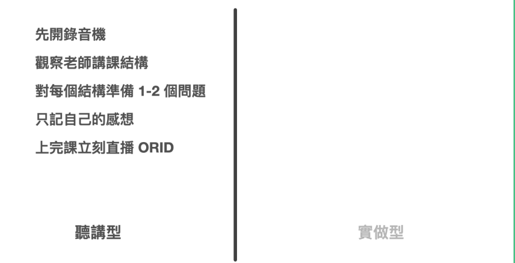

在上課時，筆記需要有組織性和完整性，以便後續複習和學習。

做上課筆記，很多人糾結的重點在於可能是要專心聽還是專心記。要用筆記、打字記還是拍照記？

但我認為重點都不是以上。而是要先釐清課程的格式。

一般來說，市售課程分兩種，一種是概念聽講型、一種是流程操作型。

Ÿ   聽講型的課程是上課時，老師說你聽

Ÿ   實做型的課程是上課時，老師示範你操作

這兩種課程的上課筆記操作方法，其實是完全不一樣的。

### 聽講型課程如何做筆記？

聽講型課程，比較常見的情形是演講或者理論課。

但坦白說上這種課時，非常賭運氣。有的老師一次就能吸住學生注意力一兩個小時，讓學生直到下課都還依依不捨離開。有些老師，剛開場五分鐘學生想放空逃離，或者直接去找周公。

若是遇到後者的情形，真的會非常倒楣，爛老師東拉西扯，自己又無法離場，甚至還得聚精會神，想辦法從裡面找到點乾貨，來對得起當初自己交的學費。

但無論老師本身能力如何，上課做筆記本身就是一件挑戰度相當高的事情。

因為老師提供的信息是通過聲音傳遞的，你必須先將聲音轉化為腦電波，並過濾出需要記錄的內容或者你自己的想法。

而且你無法快速跳過每一秒的聲音。

這也是為什麼上課會讓人感到疲憊的原因，無論是否做筆記，都需要消耗巨大的能量。

然而，有一些方法可以幫助你更有效地做筆記，降低做筆記的成本。

### Step 1: 開錄音筆

在上這種聽講課時，我建議的第一個動作，就是開錄音筆。

第一個好處：資訊不會漏接，而且下課時，甚至就能拿到聽譯服務的逐字稿進行複習。

第二個好處：當自己知道無論如何都有錄音筆音檔墊底時，大腦就不會那麼緊張，害怕漏接了什麼資訊，而在一開始就消耗了不必要多的注意力與能量在紀錄(Record)資訊之上。我們可以可以將大部分的能量分配給真正有意義的事情（產生與捕捉洞見）。

### Step 2: **觀察老師授課結構

老師的教學能力參差不齊。有些老師只是擅長表達自己的經驗，但實際上他們的授課內容可能雜亂無章，甚至會浪費很多時間。

然而，高效的老師會為他們的授課內容建立一個清晰的結構，使學生更容易理解和吸收知識。

我建議在上課時，不論老師的教學能力如何，都可以花一些時間觀察老師的授課結構。因為一旦你瞭解這堂課的結構，你就可以像有進度條一樣上課了。

這樣的觀察讓你能夠專注於你感興趣的議題，同時放棄你不感興趣的議題，從而節省精力。這樣的學習方式能夠提高你的學習效率，並且讓你更容易記住所學的知識。

### 步骤3：轉換成主動式學習心態

聽講課讓人感到疲勞的原因是聽課者不知道講課者的教學目標，只能被動地聽取講課者提供的信息並搜索答案。

聽課者預設所有的資訊都應該是重要的，因此花費了大量時間解碼每一段資訊。但最後80%的資訊都是不重要的，能量都被浪費掉了。如果講師沒有講授技巧或者沒有重點，那麼這堂課的學習效果將非常差甚至等於零。

所以換個角度，如果我們上課前先準備一些自己原本就很感興趣的問題，專心在這堂課裡找答案呢？

有了這些問題，再加上觀察結構。我們就等於開了濾鏡模式，等於所有內容都可以放掉，等到出現自己覺得相關的關鍵內容時，再專注即可。

這樣的心態與方法，就不會讓自己在上課時非常累，甚至反而最後甚至會產生「這門課非常棒，我想知道的都得到了解答」。

這是一種非常不同的積極成果。

即使你錯過了某些部分，也可以通過後續的錄音聽譯和筆記來彌補。看文字和做筆記的好處是可以直接用眼睛搜索要找到的資訊，並隨時快進倒退，而不必從頭到尾重新聽一遍。

這樣你就可以專注於你感興趣的議題，而放棄你不感興趣的議題，從而節省精力。

這種主動式學習心態不僅能提高學習效果，還能幫助你更好地理解和應用所學知識。

### Step 4: 只記自己的感想

使用這種方法，你就不需要只是機械地記錄老師講的內容，而可以專注於寫下自己對於所學知識的感想和發現。這樣的筆記方式能夠幫助你更深入地理解和吸收所學的內容，並且讓你在回顧筆記時更容易回想起當時的思考和感受。

這樣的筆記方式才是你上課真正想要得到的結果！

### Step 5 : 重新講述一遍你的心得，並錄影存檔

最後一步，也是最重要的。

在上完這門課時，立刻找同學、直播、錄影講一遍這個課的 ORID。

ORID指的是：

ORID 是

* 我看見了什麼
* 我感覺到了什麼
* 我領悟了什麼
* 我決定去做什麼

為什麼「立刻重述」這件事情這麼重要呢？

這是因為在上課之後，我們剛剛得到一些資訊。這些資訊，在我們的大腦中，還僅是一些零散的想法與線索而已。

而經過當場講述這個方法，可以立刻在腦子裡面粗略建構一段用自己觀點表達的「完整新記憶」。

這才是能讓大腦真正產生有效索引的方法。因為大腦本身，只會紀錄

* 有具體結構的資訊
* 與我有關的資訊
* 
否則過了幾天，不管當下自己抄了什麼，記錄的多詳細，當天沒有經過這樣一輪的索引創建，大腦一樣會把這些「影像」沖刷的乾乾淨淨。畢竟人類內建的「行車記錄器」硬碟儲存空間有限。

這當中該注意的訣竅有幾個：

1. 強烈建議在上課完的中午或晚上，立刻做一遍。記憶是有關於保存期限的。這個方法等於是立刻作保鮮處理，確保你的記憶能夠長期保存。

2. 講述比書寫更有效。而且講述會在大腦中產生聲音記憶，這樣可以更好地記住內容。

3. 講述的內容比書寫或打字輸出的內容更多。錄制下來後，又可以轉化為逐字稿，這樣你可以更詳細地回顧和總結課程內容。

4. 在當周重新整理資料。口述只是記憶鞏固的第一步，將它整合到已有的知識體系中需要進一步的整理。在後續章節中，我們將深入討論整理的技巧，幫助你更好地整理和組織學習資料。
5. 

## 實做型課程如何做筆記？

在參與實踐型課程時，有幾個方法可以幫助你有效地做筆記：

1. **錄製視頻或拍攝照片**：如果允許的話，使用相機或錄影機記錄老師的每一個步驟。這樣做的原因是因為在實踐型課程中，程序性知識的步驟順序非常重要。這樣你可以在需要時回顧和模仿老師的動作步驟。

2. **問問題**：如果你對老師示範的步驟或順序有疑問，可以在下課時詢問老師。這樣你可以更好地理解為什麼順序是這樣，以及一些細節的好處。你可以使用錄音設備記錄下老師的解釋，以便日後回顧。

3. **進行練習**：回家後，立即進行一遍的練習。這樣可以幫助你鞏固所學的知識和技能。在練習過程中，你可以將自己的練習結果進行一次講述的 ORID（Objective, Reflective, Interpretive, Decisional）分析，以幫助你更好地理解和記憶所學的內容。

4. **多次練習**：在當周至少要做三遍的練習。這樣做的原因是，在學習程序性知識時，我們需要使用肌肉記憶而不是大腦記憶。通過多次練習，你可以更好地培養肌肉記憶，使所學的知識和技能更加熟練。

總之，實踐型課程需要採用不同的筆記方法，包括錄製視頻、問問題、進行練習和多次練習。這些方法可以幫助你更好地理解和記憶所學的內容，並提高你的實踐能力。

这样做的原因是，在学习程序性知识时，我们需要使用肌肉记忆而不是大脑记忆。

#### 沒有萬用筆記本與軟體，但有超級捷徑

為什麼在本章我們要將「記錄」與「應用場景」各個分開講述。是因為很多人在學習筆記技巧時，認為使用一種筆記本格式或一套筆記軟件可以解決所有問題。

然而，實際情況並非如此。即使是在上課中，筆記也可以分為聽講型和實踐型，側重點也不同。因此，對於接下來的四個場景，我們將提供不同的解決方法。

透過上課例子，我們希望向大家展示筆記技巧並不僅僅是暴力記憶和整理這麼簡單。然而，將其分為不同的場景並不是為了讓筆記技巧變得更加複雜，而是反而要讓筆記流程更輕便、結果更有效。

我想要強調的是，要做到有效的筆記，不是通過用大量的粗暴記錄和整理來消耗人體能量。

要做到高效的筆記，我們需要先思考，我們做筆記的真正目的是什麼。然後，利用人類天生的機制和現代科技，找到最簡單的方法。這樣才能事半功倍。