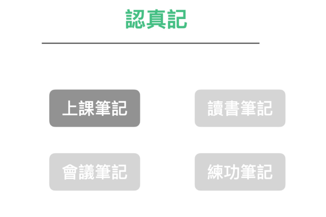

这一节我们要讨论的是上课笔记。也是最多数人心中相当棘手的场景

要深入讨论这个议题，我想再将之再拆成两个不同主题讨论：

市面上的课程分成两种，一种是听讲型，一种是实做型。

* 听讲型的课程是上课时，老师说你听
* 实做型的课程是上课时，老师示范你操作

这两种课程的上课笔记操作方法，其实是完全不一样的。

### 听讲型课程如何做笔记？

听讲型课程通常是演讲或理论课。但说实话，上这种课程时要靠运气。有些老师能够吸引你的注意力，一次就能让你聚精会神地听上一两个小时，让你不舍得下课。而有些老师，在开场五分钟内就让你想逃离，甚至想睡觉。

如果遇到后一种情况，就很不幸了。老师的讲解无关紧要，但你又无法离开，甚至还需要聚精会神，从中找出一些有价值的东西，以弥补你之前交的学费。

但无论老师的水平如何，做笔记本身就是一项非常具有挑战性的任务。

因为老师提供的信息是通过声音传递的，你必须先将声音转化为脑电波，并过滤出需要记录的内容或者你自己的想法。

而且重要的是，你无法快速跳过每一秒的声音。

这也是为什么上课会让人感到疲惫的原因，无论你是否做笔记，都需要消耗巨大的能量。

那么，有没有办法降低做笔记的成本呢？

### 步骤1：开启录音机

在上听讲课时，我建议的第一步是开启录音机。录音机的第一个好处是，确保不会漏掉任何资讯，甚至在下课后，你可以获得听译服务的逐字稿进行复习。其次，当你知道你有录音备份时，你的大脑就不会那么紧张，担心漏掉重要的内容。在一开始，就可以将注意力和能量分配到真正有意义的事情上（产生深刻见解）。

### 步骤2：观察老师的授课结构

老师的教学能力参差不齐。有些老师只是擅长表达自己的经验，但实际上他们的授课内容可能杂乱无章，甚至会浪费很多时间。

但是高效的老师会为他们的授课内容建立一个清晰的结构。

我建议在上课时，不论老师的教学能力如何，都可以花一些时间观察老师的授课结构。因为一旦你了解这堂课的结构，你就可以像有进度条一样上课了。

你可以专注于你感兴趣的议题，而放弃你不感兴趣的议题，从而节省精力。

### 步骤3：采用主动式学习心态

听讲课让人感到疲劳的原因是听课者不知道讲课者的教学目标，只能被动地听取讲课者提供的信息并搜索答案。

听课者预设所有的资讯都应该是重要的，因此花费了大量时间解码每一段资讯。但最后80%的资讯都是不重要的，能量都被浪费掉了。如果讲师没有讲授技巧或者没有重点，那么这堂课的学习效果将非常差甚至等于零。

从另一个角度来看，如果你在上课之前准备了一些自己感兴趣的问题，并专注于寻找答案，会怎样呢？

拥有这些问题以及观察结构后，你就会像打开过滤器一样，放弃所有无关的内容，等到出现自己认为相关的关键内容时再专注。这种心态和方法不会让你在上课时感到非常累，相反，你会感觉“我已经获得了想要的答案”。

这是一种非常不同的积极成果。

即使你错过了某些部分，也可以通过后续的录音听译和笔记来弥补。看文字和做笔记的好处是可以直接用眼睛搜索要找到的资讯，并随时快进倒退，而不必从头到尾重新听一遍。

这样你就可以专注于你感兴趣的议题，而放弃你不感兴趣的议题，从而节省精力。

### 步骤4：只记自己的感想

使用这种方法，你就不需要执行机器可以做的比你更好的事（Record），而可以专注于写下自己的感想和发现，而这才是你上课真正想要得到的结果！

### Step 5 : 重新讲述一遍你的心得，并录影存档

最后一步，也是最重要的。

在上完这门课之后，立即找同学、直播或者录像，重新讲述这节课的ORID。

ORID指的是：

* O：我看到了什么
* R：我感受到了什么
* I：我领悟了什么
* D：我打算做什么

这样的做法不仅可以帮助你加深对课程的理解，还可以与他人分享你的想法，以便进行交流和互相学习。此外，你还可以录制自己的讲解，以便日后复习和总结。

通过这些步骤，你可以更有效地利用听讲课的时间，提高学习效率，并加深对课程的理解和记忆。

这才是能让大脑真正产生有效索引的方法，因为大脑只会纪录

* 有具体结构
* 且与我有关

的资讯。

否则，即使你当时抄下了详细的笔记，过几天后，大脑仍然会将这些信息从记忆中抹去。

这当中需要注意的诀窍有几个：

1. 强烈建议在上课完的中午或晚上，立刻做一遍。记忆是有关于保存期限的。这个方法等于是立刻作保鲜处理
2. 讲述比书写更有效。而且讲述会在大脑中产生声音记忆。
3. 讲述的内容比书写或打字输出的内容更多。录制下来后，又可以转化为逐字稿。
4. 在当周重新整理资料。口述只是记忆巩固的第一步，将它整合到已有的知识体系中需要进一步的整理。（我们将在后续章节中深入讨论整理的技巧。）

## 实践型课程如何做笔记？

实践型课程需要采用不同的笔记方法。

然而，第一步通常是录制。

当然，在一般情况下，开启录影机可能会比较困难。但是，我建议至少使用相机（通常情况下课程是允许的），记录下老师的每一个步骤。

这样做的原因是因为在实践型课程中，所谓的程序性知识是最重要的。

而且，程序性知识中的步骤顺序非常重要（更多背景知识请参考“打造超人学习”）。

就像在烹饪过程中，先煮开水再下面条与先下面条再煮开，会产生截然不同的结果。

上课老师所示范的顺序，绝对是他经过成千上百次尝试得到的结果。自行跳过或改变顺序通常会产生极其糟糕的结果。

因此，在学习程序性课程时，你要记住的是老师的每一个动作步骤，而不是你自己的感受。更准确地说，在这些课程中，你需要“以似懂非懂的状态直接模仿”。

如果有任何问题，在下课时可以询问老师，了解为什么顺序是这样，以及一些细节的好处（此时可以进行录音）。

然后回家后，立刻要进行一遍的练习，并将练习结果进行一次讲述的 ORID。

并且在当周至少要做三遍的练习。

这样做的原因是，在学习程序性知识时，我们需要使用肌肉记忆而不是大脑记忆。

## 没有万用笔记本与软体，但有切西瓜超级捷径

为什么在本章我们要将「记录」与「应用场景」各个分开讲述。是因为很多人在学习笔记技巧时，认为使用一个笔记本或一套笔记软件可以解决所有问题。

但实际情况并非如此。即使是在上课的过程中，也可以将笔记分为听讲型和实践型，它们的重点也不同。对于接下来的四个场景，我们将提供不同的解决方法。

我想通过这个例子，向大家展示笔记技巧并不仅仅是暴力记忆和整理这么简单。然而，将其分为不同的场景并不是为了让笔记技巧变得更加复杂。

我想要强调的是，要做到有效的笔记，不是通过用大量的粗暴记录和整理来消耗人体能量。

要做到高效的笔记，我们需要先思考，我们做笔记的真正目的是什么。然后，利用人类天生的机制和现代科技，找到最简单的方法。这样才能事半功倍。
