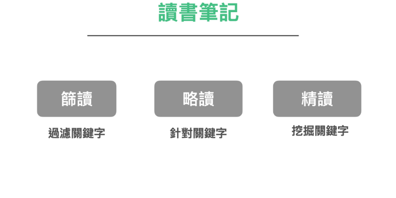

當您閱讀一本書時，筆記需要更深入的思考和分析。

常見讀書筆記的形式有：

* 划線筆記：通過在書上劃線或標記重點句子，快速捕捉到關鍵信息。

* 在書上做筆記：在書的空白頁或邊緣做筆記，詳細地記錄自己的思考和理解。

* 抄句子在筆記本上做筆記：在讀書時遇到一些特別有啟發性或重要的句子，將這些句子抄寫在筆記本上，並加上自己的註解和思考。

* 寫讀後感：閱讀完一本書後，寫下自己的讀後感和心得。回顧和檢視自己的閱讀成果，並將所學應用到實際生活中。

但究竟在閱讀時，我們應該選擇哪種方式記錄筆記比較好呢？

我認為我們不應該這樣武斷的推論。

更準確地說，讀書筆記需要根據不同的場景進行分類。

在《打造超人學習》的讀書篇中，我介紹了一種閱讀方法論。

這套方法論，把鑽研一個領域的書，分成三種閱讀模式：

### 第一：篩讀

許多人在讀書時，常懊悔自己浪費時間買了難啃難讀或非常水的錯書。但我計算過，其實買錯書非常正常。我自己實測的結果是，買到一本具備正確資訊（符合我們當前程度，且是自己認同且需要）的書，在書市上的機率最多也只有 50% 而已。

如果一開始就花了大筆力氣去精讀一本錯的書，那豈不是把力氣花的很冤枉嗎？

所以在鑽研一門新領域時，要採取篩讀 -> 略讀 -> 精讀的一個流程。

在第一輪篩讀。只需要大致翻翻拿到的書籍。目的是找到這個領域重要的關鍵字、問題、論述。鎖定一批書可以進行下一輪的「略讀」

在略讀過程中，再過濾出一兩本真正夠好的書，進行精讀。

在略讀時，我們粗略的畫線即可。而在精讀時，才要認真的去做筆記。

### 如何精讀一本書

### 如何精读

那麼我們又要如何精讀呢？

而且，就算是精讀。實際上都有分兩種模式：密度低的書與密度高的書，兩者精讀方式是截然不同的。

一般來說，對於資訊密度較低的書。我會採取類似極速讀書法的閱讀方式：

1.        先對這本書準備一些基本的問題。
2.        然後帶著問題搜尋我要的答案
3.        將在書本中看的金句一一複製貼到數位筆記本之內
4.        看完之後再對金句逐一的打上 #tag 做點輕分類
5.        將這本書的金句搜集成一張該書的書籍金句筆記卡

而資訊密度較高的書，我就會反過來操作。

這類書籍，整本書上金句太多，一句一句複製貼上太累。於是我採取的方式是：

1.        一次將一整章書內容貼到數位筆記本內
2.        將不要的句子砍除
3.        將砍剩下的內容重新編排成我自己要的新結構
4.        將這本書當中出現的名詞或概念，在筆記軟體上整理成 「卡片」
5.        重複整理過去的卡片，利用名詞相連，找到相關的資訊比對編刪，重新組織出新的卡片、新的見解。

### 卡片筆記法

在精讀模式的章節中，對於「將金句複製起來貼到筆記本裡」、「整理成卡片」、「打上 Tag」「用軟體串連在一起」，讀者聽到這套模式可能聽起來很驚奇，會覺得怎麼可以如此操作？

但這其實是一個幾十年前就被發明的方法，只是當年沒有軟體，筆記方法的設計者，當年用的方式是土法煉鋼的紙質索引卡片。

是的。這套方法就是最近十年開始「紅」起來的卡片筆記法。

卡片筆記法是由德國社會學家盧曼 Niklas Luhmann 所發明。他在 30 年多年間的研究生涯中，一共出版了 58 本著作與數以百計的論文，當中還橫跨多個領域。

當時，他發明了一種卡片筆記法。他將有興趣與搜集到的資訊，隨時捕捉到卡片之上。等到這些資訊卡片累積到一定程度時，就重新整理這些卡片，進行創作。這種卡片筆記法，成了他的高產秘密武器。

這個方法乍聽之下很費工，很多人羨慕盧曼的高產，但很少人會實際去跟隨這個流程，因為光想像流程就覺得很花時間。

但我自己在實測之後，才發現盧曼這種筆記方法，其實一點都不費工，反而非常科學與高效。只是一般人並不知道如何入門這套筆記方法。

卡片流程法在一邊傳統「記錄」->「應用」的流程，複雜到無法想象。

但是卡片筆記法本身的思維在「紀錄」->「整理」、「搜尋」->「應用」->「軟體」用起來就像雷神之槌般威力無窮。

我曾經用這種方法搭配上現代最新的一套筆記軟體 Logseq閱讀了一套 1200 萬字的美國經濟學古書《Modern Business》。在兩三個月的時間里，寫了兩三千張知識卡片。

這些卡片不僅讓我最後讀透了古典經濟學，從卡片的交叉詞條中，我更從中發現了許多現代經濟學中自相矛盾或虛幻的立論與假設。

我才領教到這套卡片筆記法威力之強大。後續研究各種艱深的探索性學問。我都使用這套方法。並且挖掘出很深的洞見。

作者注：

我們在目前的章節中，卡片筆記法暫時點到為止。

本書的講述結構是幫助大家正確建立梳理資訊的流程和方法，唯有理解：「紀錄」->「整理」、「搜尋」->「應用」->「軟體」這套新流程思維，才揮得動這把槌子。

後續的章節我們將繼續回來為大家講述這套筆記法。
