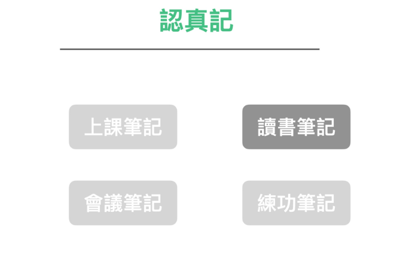
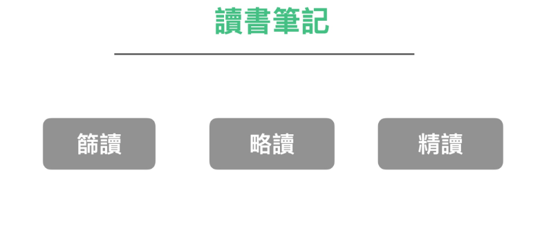
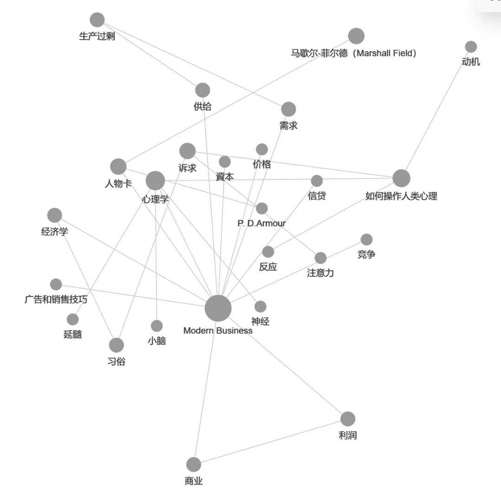

这一节我们要讨论的是读书笔记。这是次多数人感到棘手的场景

到底我们在读书时，是应该

* 画线笔记？
* 在书上做笔记？
* 抄句子在笔记本上做笔记？
* 只撰写看书心得？

我认为不应该这样讨论。

更精确的来说，读书笔记还是得再看细分场景。

我在打造超人学习的读书篇曾经介绍过一套读书方法论。

这套方法论，把钻研一个领域的书，分成三种阅读模式：

第一，筛读。许多人在读书时，常懊悔自己浪费时间买了难啃难读或非常水的错书。

但这概率是非常高的。我自己实测的结果是。买到一本有正确资讯的书，在书市上的机率也只有 50%而已。

如果你花了大笔力气去精读一本错的书，那岂不是把力气花的很冤枉吗？

所以在钻研一门新领域时，你要采取筛读 -> 略读 -> 精读的一个流程。

在第一轮筛读。只需要大致翻翻拿到的书籍。目的是找到这个领域重要的关键字、问题、论述。确定一批书可以拿来进行「略读」

在这过程中，再过滤出一两本真正够好的书。

这几本书才值得我们去精读。

在略读时，我们粗略的画线即可。

在精读时，我们才要认真的去做笔记。

  
### 如何精读 

那么我们又要如何精读呢？ 还要分这一本书是资讯密度低的还是密度高的？

一般来说，对于资讯密度较低的书。

我会采取类似极速读书法的阅读方式：

1. 先对这本书准备一些基本的问题。
2. 然后带着问题搜寻我要的答案
3. 将在书本中看的金句一一复制贴到笔记本之内
4. 看完之后再对金句逐一的打上 #taq 做点轻分类
5. 将这本书的金句搜集成一张该书的书籍金句卡

而资讯密度较高的书，我就会反过来操作。

因为这类的书，整本基本上金句太多，一句一句复制贴上太累。于是我采取的方式是：

1. 一次将一整章书内容贴到笔记本内
2. 将不要的句子砍除
3. 将砍剩下的内容重新编排成我自己要的新结构
4. 将这本书当中出现的名词或概念，在笔记软体上整理成 「卡片」
5. 重复整理过去的卡片，利用名词相连，找到相关的资讯比对编删，重新组织出新的卡片、新的见解。

### 卡片笔记法法与卡片笔记软体

最近几年，有一种时髦的笔记法开始「红」起来。叫做卡片笔记法。

卡片笔记法是由德国社会学家卢曼 Niklas Luhmann 所发明。他在 30 年多年间的研究生涯中，一共出版了 58 本着作与数以百计的论文，当中还横跨多个领域。

卢曼发明了一种卡片笔记法。他将有兴趣与搜集到的资讯，随时捕捉到卡片之上。等到这些资讯卡片累积到一定程度时，就重新整理这些卡片，进行创作。这种卡片笔记法，成了他的高产秘密武器。

乍一听之下很神奇，这么多卡片不是整理起来更费工吗？怎么可以让他更高产。

其实这种卡片笔记法用起来也是有诀窍的。配上现代最新的一套笔记软体 Logseq 更是威力无穷。

但我用这一套方法，驾驭起一套 1200  万字的美国经济学古书 "Modern Business "却是十分省力。

花了两三个月，为此写了两三千张知识卡片

不仅最后读透古典经济学，从知识卡片的交叉词条中，我更从中发现许多现代经济学中许多自相矛盾或虚幻的立论与假设。

这套卡片笔记法威力十分强大。我后来研究各种艰深的探索性学问。都使用这套方法。并且挖掘出很深的洞见

本书会进行卡片笔记法的教学吗？会，但会在最后一章。

主要原因是这本书主要的结构，我想先帮大家正确建立起梳理资讯事倍功半的流程与方法。

卡片笔记法相当红，但是，实际使用的人，相当少。甚至很多发文谈卡片笔记法的人自己没有实际使用，通常只写了介绍文章就到此为止。

背后有两个原因：

一、主要是实务上难以操作。
	- 如何记下与整理这么多卡片，对许多人光在工具上就是个问题。
二、使用错误的流程记笔记。
    - 许多人在卡片笔记法上从入门到放弃，是在记录了几十张卡片以后觉得自己虽然零碎卡片记了一堆，却没有实际串连在一起，也没有产生什么神奇的洞见，于是直接放弃。
    - 会造成这样的结果主要是一般人在笔记的流程上有根本致命性上的错误，所以才会做了数十张卡片，却什么也没发生。介绍卡片笔记法的书，只讲了最后的结果，并没有谈「正确的流程」如何进行操作

我们会在讲完所有关于笔记的正确流程观念后，回头来教大家如何正确使用卡片笔记法，并且搭配 2020 年后最新的超级笔记软体 Logseq 做示范，教大家也能一样做出这种威力强大的常青探索型洞见笔记。

