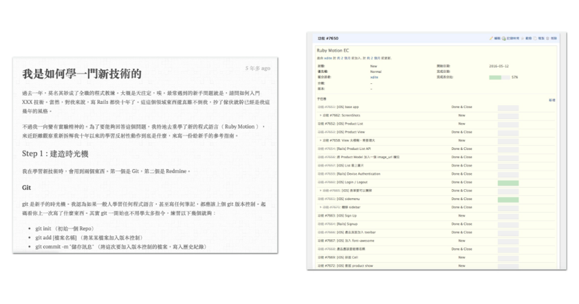
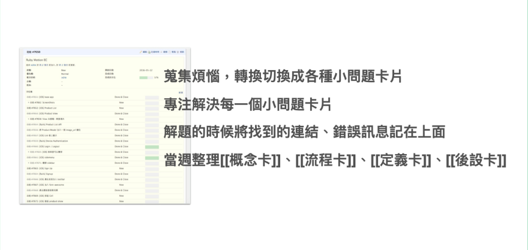

最后一种记笔记场景，是练功笔记

我们在职场上，有时候需要纪录自己上班所需场景的操作笔记。或是对于学习职场技能时，所需要记一些学习笔记。

这又该如何进行呢？

关于这个议题，我在打造超人学习的章节也略有提及，

### Step 1: 将任务先拆分成小问题

主要的流程概念是

将想要进行的任务，拆细变成清单，先变成小问题。

拆成小问题的好处是：

1. 当问题颗粒小时，容易完成，成就感较高
2. 有些问题难以解决是因为问题颗粒大以及模糊，将问题拆分，就可以把困难与未知的问题先行隔离出来。未来再进行研究实做。就不容易撞墙

再来，当我们将之拆细后，就容易绕着这个问题去搜集资讯。

### Step 2:  将搜集到的相关记录（包括错误讯息），钜细靡遗的纪录下来

我在学习技能时，还有一个特殊的习惯：就是会将在学习时找到的网址，都集中贴在这个任务的留言区。

然后不管是错误讯息、错误的尝试或正确的尝试，我也会贴进去。

当然读者读到这里可能会觉得奇怪，贴正确的尝试可以理解。为什么我要贴错误的尝试与错误讯息呢？

这是因为错误的尝试本身也是一种「正确」讯息。

有时候挑战未知的领域时，我们也会无意中踩到一些坑。如果我们没有标记出这些坑时，下次我们还是会无意中踩到。而会踩中这些坑，也是我们某些观念不是很正确，而这些坑，也可能隐藏着某些未来需要学习的新资讯。

很多人在学习新技能时很是苦恼，因为要记的线索、资料、资讯实在太多太杂了。也散落各处。

所以我自己才会发明了这个方法，等于是在学习练习时，就「录制」自己学习的过程。且是围绕着该问题集中录制。

将来遇到相似的问题，我就可以打开这个纪录，一捞出来，记忆就全部回来了。

### Step 3 : 事后一定要再单独整理一篇总结

当然，「录制」只是这个方法的前半。

另外一半更重要，就是必需要写总结。

过去我在当程序员时，工作或学技能时，都是使用这套方法，纪录下我解问题所找到的相关资料，然后将问题解开。

我通常在一两周之内，还会回头看当时的任务记录，再总结发一篇新的博客作为教程。

这样做的好处，第一个是复习。第二个是后面写的那一篇就是以后可以立即马上再利用的「程序性ＳＯＰ」或「概念教学」文章了。在未来不管是他人与自己都可以马上再拿来重复利用。

而不是看着一堆线索笔记，再花上与第一次相同的时间研究解决。

