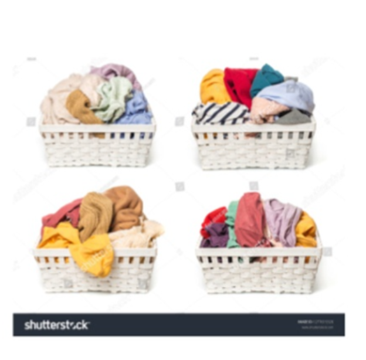
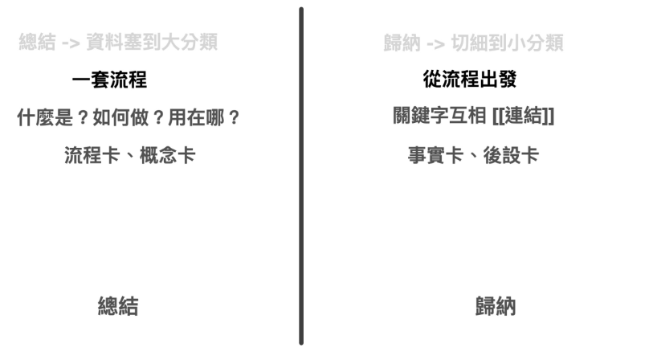
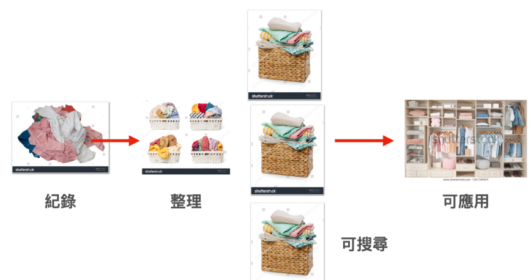
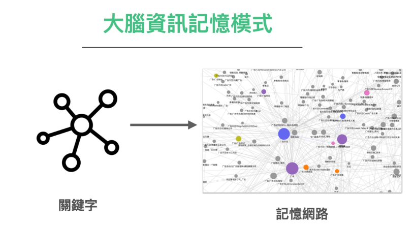
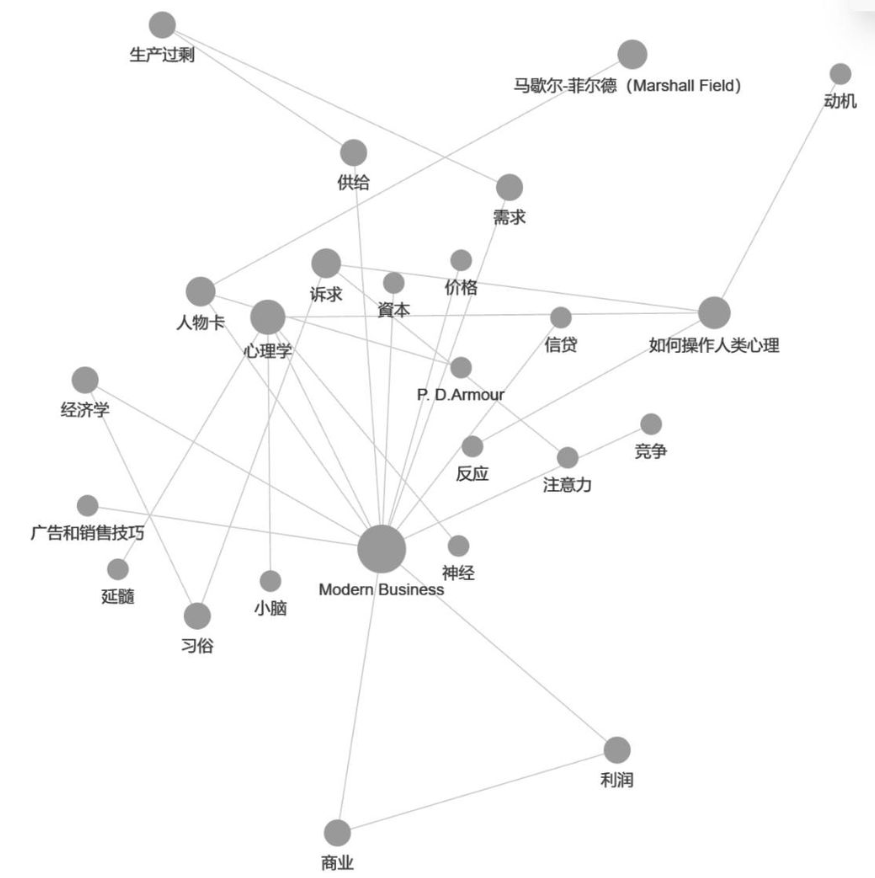

线索 -> 资料 -> 资讯。

还要经过两个环节：「总结」与「归纳」。

这两个词乍听之下好像差不多，但其实上本质非常不一样。

总结说的是将资料塞到大分类里面。

归纳就是切细到小分类。

许多人做笔记一开始就撞墙的根本原因，是因为他们直接先「归纳」再「总结」，而不是先「总结」再归纳。

等于是从地上的洗衣堆里面直接拿衣服，马上折就放进篮子里面。折到几件了又发现篮子分类错，又拿出来调整。结果折好的几件又被搞得乱七八糟了！

基本上我们在折衣服时是不会犯基本错误的，因为这样非常没有效率。

但是我们在做笔记时却非常喜欢这么做。

先开个分类笔记本，对着空白的页面填东西，写了一点之后又发现自己分类犯错，只好再开一个笔记本，写没几页又觉得自己搞的一团糟，于是就放弃了笔记整理过程。

这就是先「归纳」再「总结」的大毛病。

要轻松整理笔记，我们得「总结」再「归纳」。（注）

### 总结

那么，我们要如何总结。

这里我推荐使用「打造超人学习」时曾经引用的一套知识分类方法「布鲁姆教育分类法」

布鲁姆将知识分类成四种不同的知识：

* 事实知识
* 概念知识
* 流程知识
* 后设知识

所谓的总结，你可以取用这里面的概念知识与流程知识。

* 整理一套流程
* 什么是？如何做？用在哪？

归结出一张张「流程卡」与「概念卡」。

### 归纳

那归纳是什么呢？

归纳是围绕总结整理出来的流程，去拆解里面的每一个事实，钻研如何将里面的每一个步骤调整的更好。组织围绕出现的关键字。

### 总结与归纳

所以，当我们在整理笔记或者使用笔记软体时，其实一开始不应该先分类。而是只要经过一遍粗的整理。

上课就算当天比较没空，也要将这些知识的

-  流程
-   什么是？如何做？用在哪？

先打包一遍。

等待有空的时候，再进行关键字的精细研究与整理。

这样先「总结」一遍，就可以让你未来在调用这些知识时，很方便快速了。

毕竟我们已经分好篮子了。

这样一来，当我们回头看这张流程图时

是否就比较有感觉了呢？

### 卡片法如何与笔记软体搭配

在前几节，我们曾经提及

大脑有一个记忆模式，是用关键字去串连。关键字再串成一串扩散成整个记忆网路。

这张网状节点图就是使用 Logseq 这套笔记软件做出来的。

Logseq 是一个 2020 年开始火红起来的笔记软体。一推出在 Geek 圈就十分火红。因为这个软体，完全可以把卡片笔记法的威力可以发挥到最大。

Logseq 的底层节点，就是透过一张一张的节点卡片（每个卡片是一个关键字 tag）所串连。透过串连，笔记者可以直接在当则笔记看到「相关」笔记的串连与引用关键字。

这些关键字并列在一起，甚至可以触发笔记者的灵感，或挖掘出笔记者原先没有发现的资讯。

而且这套笔记的作用与结构，本质上就是与大脑相同

* 日期编排
* 关键字串连

我之所以能轻松啃下 Modern Business 这套千万字巨作，就是有赖这套软体的帮忙。使用上简直如同我的第二大脑，唯独不同的是，用 Logseq 整理笔记，不但不消耗能量，甚至还越用越上瘾。

关键来了，如何上手呢？

许多想要入门卡片笔记法与Logseq 的笔记爱好者，在第一次接触到这套软体时，也有相同的兴奋感。但是打开页面，写下关键字后，却不知道怎么开头，也不知道如何才能堆积出这样的网路。

我在前面的章节，提及到之所以会发生这样的情形。是因为「关键流程」错了。

因为，当我们在制作笔记甚至卡片笔记时，不应该一开始就先写「名词卡」。

而是应该先塞进一堆还未梳理的知识，然后帮这堆东西先打 #tag ，等 #tag 累积到一定程度后，再用 [[page]] 收集起来。

我在看这套书时，所使用的手法，基本上是

1. 在笔记（每日的笔记）是贴进我想看的章节，在阅读时一步一步砍掉我不要的句子。
2. 然后在句子间，针对我认为是关键字的地方打上 "[[]]" 标记。
3. Logseq 会针对 "[[]]"  自动进行索引串连。若点进去 "[[关键字]]"，这个关键字，点进去自己就是一页，你可以想像成维基百科的条目，只是内容是空白的，但下面注释方面会自动显示所有提及到这个关键字的所有页面。
4. 后续你在编辑这个条目时，就可以看着这些相关资讯，快速关于组织这个条目的内容，编写该名词卡。
5. 这张网状图，就是我经过经过一遍一遍的重新梳理，写了快两千张卡片，最后才变成这张壮观的网路。

看起来虽然很耗工。但是其实远比写其他领域笔记来的轻松。因为这样的笔记法，本质上是在扫地、清垃圾、打包、整理。比玩 Steam 上的 House Flipper 游戏（房产翻修达人，游戏内容是扮演房屋仲介，打扫脏污并重新粉刷装修房子，最后再售出）还来得有趣更上瘾。

在接触 Logseq 之前，我甚至自己也未想像过做笔记甚至可以是一件可以成瘾的事。

甚至我的读书会成员，在用了这套方法后，许多人竟然变成了笔记魔人，因为砍东西扫东西实在太有成就感了。

### 打造不断成长的长青笔记

过去，许多人以为「做笔记」是要洞察以后写下自己的想法。

其实完全是可以用反方向的方法。

因为有时候我们看了资料后，虽然会产生想法，但在大脑角度来看，记下的节点彼此之间，还只有处于很微薄的电流。根本无法输出，何况整理，甚至分类。

但是反过来做這件事就不一样了。

如果我们是从复制贴上一本书的内容开始，砍掉自己不要的句子。以重新创造组合内容的角度去「写笔记」，那事情就会简单多了！砍东西真的很轻松。一边砍一边编修，要做出超大的「结构洞见笔记」，甚至会超级快速。

用这样的过程「编」成的笔记，你或许担心这份笔记不是原创的？其实真的不用担心

1. 基本上世间所有的笔记，几乎都是口水笔记。你一定是看了前人的示范资讯，才会有手上的这份笔记。
2. 很多时候，我亲身的实验，就算是用砍书的方法做笔记，得到的洞见甚至会与书中原作者大相迳庭，甚至完全相反。（我在后面的研究笔记章节会提到为什么会有这样的结果）

重点是使用这样的方法，可以让你在读书时，非常的省力。可以交叉读非常多书，甚至读非常艰难的书，都不太成问题。

而且这份笔记，是完全新鲜的！因为这本笔记，随着内容的增添，不断的在翻修与重新连结。

现在笔记界有个词叫做 everygreen 常青笔记，很多不做笔记的人往往难以想像什么叫常青。谁会不断的整理笔记，那不累死自己吗？

其实，还真有这种不累的笔记法！

卢曼的卡片笔记法，就是这样的笔记原理与效果，只是当时他用的载体真的只有「卡片」而已。后人之所以用不动卡片笔记法，是因为第一步，在写卡片时，就用错方法了。一开始就做「归纳」，于是从入门就放弃。

