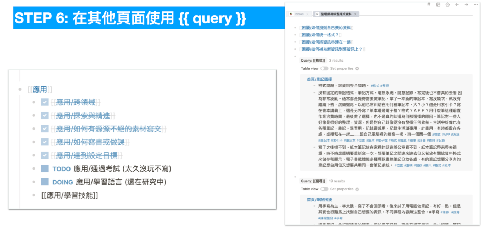

当然，我们做了那么多笔记，并不是堆积来炫耀的。最后总归是要拿来整合、应用、输出的。

许多人都曾遇到过这样的一个问题，用了市面上笔记法，虽然当下做了很多笔记，最后却无法整合起来。

为什么会出现这样的情形呢？

其实归根究底的原因，就是这些笔记法，多数只是教你记录的方法（或当时纪录整理）。这些当下的~~资讯~~线索本身并没有经过梳理，自然也无法整合。

要真正能够整合笔记，做到能够应用、输出的效果。你必须经过这样一套资讯淘洗（纪录 -> 整理 -> 总结 -> 归纳）的过程，才能叫整合。

也唯有淘洗到如此小的颗粒，才有机会做到不断进化的笔记。

## 如何搭配卡片笔记法 + Logseq 使用

### 1. 先使用「日记」模式搜集线索

以下是我平常如何使用 Logseq 针对一个领域作笔记的示范。

Logseq 有两种纪录下手的方式：

1. 日记模式
2. 词条模式

词条模式，是在你很确定自己就是要开什么关键字开始撰写时，直接开该词条的页面开始撰写。而日记模式是，当你暂时还不知道要放哪时，可以将搜到的资讯贴在「日记」上。日后再回来整理

### STEP 2: 使用 ORID 快速组织当日感想

通常我会在日记模式贴入今日随手搜到的资讯。有时候是边看边查边贴到这里。

不过呢，有时候只是单纯想要记录间今天发生什么事，我有什么感想。

我会使用最小成本 ORID 的模版变成答题模式，来加速在这个阶段的效率。

### Step 3: 将这些线索打上 #tag 

我并不是一个有空随时整理笔记的人。不过呢，因为有了 Logseq，我在随手记完之后，会将我认为有意思的段落，先打上 #tag 。

以后我在查阅内部某些词条上，就会带入这些资讯，那时我再整理不迟。

### Step 4: 整理成词条 PAGE

等这些线索累积到够多（大概是 5-10 条）

我就会将之整理成 PAGE 关键字页面。

关键字通常是一个名词的解释，或一套流程的纪录等等。

这当中，如果在词条之内，有看到人名，或书名，我也会立刻先标记人名卡或书名卡。通常会有这样的情况，会是当时摘录时，原始资讯所提及。

而这往往是重要线索（就我以往的经历，通常是重要来源，浓度会超高）。

但我在阅读该本书时已经很忙，没有空再去翻阅另外一本书。我就会利用这个方式先记下。有空时再开书籍卡，再去阅读被提到的书或作者。

Namespace 的用法是：

当有时候一个条目过于巨大(大约是 2-3 页)时，我会把一个条目拆出去，用 Namespace 拆成子页面。随时保持每个页面一下子就能翻完的状态。

## STEP 5: 不是所有东西都要念完 / 整理完

这是一本常青笔记。常青笔记意味着随时更新。但这也意味着你不需要一口气整理完。

在整理笔记时，我常常会萌发出新想法，或关键字。但我实在没有空追溯填补。

这时候我会使用 TODO / DOING 的关键字，先把事情放着。

等待下次我有空时，再接续之前的研究进度

### Step 6 ：使用 QUERY 技巧

Logseq 本身就内建关键字关连功能，而 Query 技巧是在当页面强行拉进你觉得有关的关键资料并展现。

通常我会在做研究比对时，利用页面这个内建功能进行横向比对。

## 最后归纳出哪些卡片

一般来说，我最会常会归纳出的卡片有几种：

* 名词卡
	* 是什么？
* 流程卡
	* 如何做？
* 后设卡
	* 如何做得更好？
* 书籍卡
	* 相关进阶书籍
* 人名卡
	* 作者相关书籍
* 模版卡
	* 文章写作模版
	* 书籍写作模版
	* 任务跟踪模版
	* 会议纪录模版

到这些模版基本上就足够用了