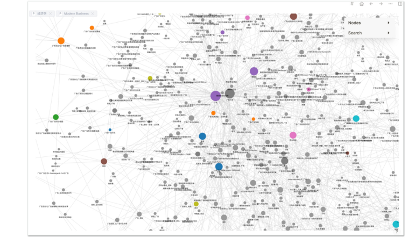

vergreen note（長青筆記）是一個用於描述一種永遠保持價值和有用性的筆記或文章的概念。意思是做出一份記不受時間限制，不論過了多久都能保持其可靠性和相對的不變性的筆記。

這種筆記通常涉及一個主題或概念的深入探索，提供有價值的見解、觀點、知識和資訊。高度結構化、時常更新，這份筆記得讀者讓筆記服務的讀者，可以隨時查閱和參考，並且在各種情況下仍然有價值。

這是筆記人在筆記領域的最終目標，但這也是存在夢裡的一個目標。

因為，事實上長青筆記，受限於筆記載具（紙筆、軟體、筆記檢索方式、筆記更新方式）的限制，實在太難達成了。

而且，人類都是懶惰的。我們都希望最好做筆記時，能夠Write Once, Use Anywhere。

這世界上最好可以有人發明套筆記法，能讓我們做到當初只要記一次，後續只要不斷複看這本筆記本，就能達到最大學習效果。

後續再拿出這本筆記本時，也可以從這裡面快速取用資訊，立刻實戰應用。

世界上存在這種筆記法嗎？

我希望它存在。因為我也懶。

但事實上這套筆記法不存在。

不僅不存在，這個想法還是因為我們受限於紙筆工具，才「幻想」出來的「可能」的解決方式。

我當時在重新梳理筆記流程時，發現這個原因時，也相當震撼。因為在我們一路走來的學習生涯中，一路都在追求這個懶人聖杯，一直都在等終極筆記法出現。

卻從來沒有思考過，其實這個「聖杯」與原先我們用的筆記流程、所做的努力方向、產出效果是如此不合理。

## 「整理」筆記而不是「寫」筆記

我還想在本書帶出一個新概念，新流程：也就是「筆記」是要用「整理」出來的，而不是寫出來的。

筆者觀看這本書的時候，是否有留意到筆者在數位筆記流程一個不尋常的筆記習慣。就是對於資料的堆積與梳理。都是用**錄的、貼的、砍的**。

1.     錄下上課的內容，轉成逐字稿
2.     直接複製書籍裡面的金句、段落貼進筆記，砍掉自己不要的

相較於他人的筆記都是「自己重新寫過」。這種大膽的筆記手法，很不尋常。

其實不是我的手法大膽新穎。而是我把動作放大放慢了。

這裡讓我重新播放我們上課時的情景：

這裡讓我重新播放我們上課時的情景：

#### 上課場景

* Step 1: 老師講課　（我們抄下內容）
* Step 2: 我們對於剛剛抄下的內容　（想出我們自己的見解）
* Step 3: 我們重新看著我們的筆記　（重新寫出新詞條）

#### 看書場景

* Step 1: 閱讀書籍　（我們摘抄書上的內容）
* Step 2: 我們對於剛剛抄下的內容　（想出我們自己的見解）
* Step 3: 我們重新看著我們的筆記　（重新寫出新詞條）

我做的是

1.     讓機器去做摘抄的動作（對課程錄音或複製書上段落）。
2.     我不馬上重寫筆記，只當「筆記內容編輯」，剪下覺得有價值的段落
3.     我不馬上整理筆記，而是在「有空整理」的時間，透過「整理」的方式，「歸納」出新詞條。

這的確是「筆記流程」: 錄下資訊 -> 篩出有用的內容 -> 重新內化。

但每一步，這個新方法都更省力。「不花腦力」且「不需立刻執行」。

而且效果更好：原始內容保留的更多，自己最終整理的結果，越接近自己的洞見。

### 用對大腦省力的方式，生出品質更好的筆記

傳統筆記流程之所以辛苦，是因為以下原因。

#### 1.     即時算力要求太高

我們在學習一個新領域時，不但要同時紀錄，還要同時整理，甚至還要同時生成。這對於大腦來說，即時算力的要求太高。

#### 2.     對於新領域掌握不夠

我們對於一個新領域要產生洞見，必然是要先大量蒐集知識，才能解析出他們當中的關連性與重要性。

然而在上課時，光「大量蒐集知識」，我們就沒有足夠的時間與算力可以進行「解析」了。

#### 3.     生成新內容的要求算力太高

大腦生成新記憶的原理並不是憑空創造一段新內容。而是基於「已知的節點」，在彼此之間生成新的連線。

但在學習一個新領域知識時，大腦並不知道哪些是「有效節點」，更遑論生成「有效」連線。

基於這三個原因，上課即時做筆記，對任何人都是苦差事。

但是如果我們改用放大放慢的新流程，去「整理」筆記，效果那就完全不同了。

首先我們是從複製貼上一本書的精髓開始。

1.     首先我們第一個跳掉了「記錄」的步驟。
2.     第二，從中砍掉自己不認同不理解的句子。
3.     第三，以軟體「大量重複」浮現的關鍵字作為基礎，看出「關連」，並以新視角去重新創造「自己的看法」

以這樣的省力流程去「做一份筆記」，不僅分散算力，更能夠把絕大多數的腦力用在關鍵動作：「找關連」，出來的最終筆記，品質反而是比較高的！

### 記憶是基於「重複」而不是「生成」

當然，讀者乍看一下這種新流程，可能會有稍許疑惑，這樣的流程，似乎不過腦，真的能有效吸收？

讓我來仔細解釋，大腦的記憶原理。這樣的筆記方式，其實並不是「不過腦」，而是「過很多遍腦」。

首先

1.     在整理筆記的時候，首先這個新領域的關鍵概念一定會浮現在你面前「非常多遍」。

2.     我們是在「重複看到非常多遍」同樣的新東西時，覺得放在那邊看起來很煩，於是應該要收納起來「放在一個新地方」，才另開一個詞條「歸納新意義」。

大腦對於一個新資訊是否有意義，判斷的規則是：

1.     是否一直重複
2.     是否與舊記憶中的「元素結構」「重疊」（相同意義）

所以這樣的新流程，首先就會讓我們在閱讀時，看過很多遍。只是一點都不費力而已。

而我們最終又會重寫這個詞條。「重寫」的動作在大腦的角度，就是「生成新的連線」。

而所謂「記憶」是這個「連線」被「重複」刻畫多次。

我們可能會對於這個新流程感到疑慮，那純粹是我們被以前的「費力」才能「記住」這個印象所綁架了。

新的流程可以讓我們在做筆記時五倍省力，而且還有五倍的記憶效果。因為你可以重複這個流程非常多遍卻一點都不累。

同樣的時間與精力，原本我們連抄下筆記的時間與精力都不夠。但在新流程下，我們可以拿來做 3-5 遍以上的粗整理、細整理了。

有經過仔細整理的產出，當然是更好的學習成果。

### 「洞見」就是原創筆記

讀者對這個筆記法的第二個疑慮：可能會擔心如此寫出來的筆記，最後只是複製原作者一份內容，可能沒有什麼學習上的幫助。

非也，在我的實測成果中，用這樣方式的流程與梳理，透過交叉「整理」「挖掘」，我還常常出與作者截然不同的觀察洞見，產生意外的驚喜。

（我在後面的章節會提到為什麼會有這樣的結果）

讀者對這個筆記法的第三個疑慮：可能是筆記內容的原創性與著作權。

複製與摘抄真的可以嗎？

首先，我們自己寫的筆記放在我們私人筆記夾裡面的草稿、整理箱。我們摘抄筆記是「使用」作者的內容，但是著作權談的基本上是重新製作與公開。

只要你不公開自己的研究筆記，基本上沒有踩線的問題。

第二，世間作品很少處於原創狀態。大多數的創作與筆記，幾乎都是口水筆記。一定是看了前人的示範資訊，才會有手上的這份筆記。

上面的「概念」「定義」「流程」早就存在世界之中。「概念」與「定義、「流程」的摘錄、整理，並沒有什麼「原創」問題。

而筆記嚴格的定義，指的是你看完這些「概念」、「事實」的「內容組織結構」的一手角度「意義重述」。

最後我們的筆記一定經過自己的多重組織、整理、編修，最後產出的新結構、新想法，最後怎麼可能還會跟原作一樣呢？

而且，用傳統流程根本不可能造出「長青筆記」，誰有可能有那種「腦力」啊！

長青筆記當然是要靠這種「複製」、「砍掉」、「重新整理」。才能不斷的進化。保持新鮮。

這本筆記，內容每天可以不斷的進行翻修、增添、重新連結。而且我們還可以輕鬆的從中找到有效的資訊，並快速應用出來。

現在，你知道我是如何在兩三個月內，就讀完千萬字巨作 Modern Business ，並且做出幾千則交叉連結筆記的秘密了吧。

這放在以前，一次讀破經濟巨作並且還能自己整理幾百條新洞見對我來說根本是想都不敢想的事。如今卻完全不是什麼費力的事。甚至，我還越讀越上癮。

好像在玩整理紙箱發現新寶物的尋寶遊戲一樣！

在此前，我甚至也未想像過做筆記甚至可以是一件能夠成癮的事。