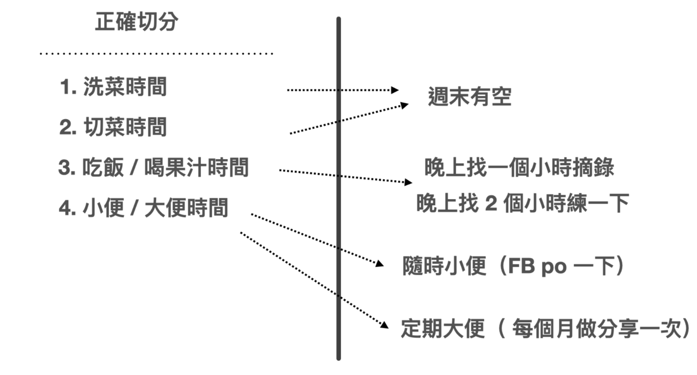

我们已经讲完了如何整理笔记本身，现在我想谈谈如何抽出时间来整理笔记。

我们都知道整理笔记很重要，但是如何在忙碌的日程中挤出时间整理这些线索、资料和信息呢？

这是许多人不愿面对的最大问题：我们知道整理笔记很重要，但是我们就是没有时间去做啊！

这个问题看起来很难，但本质上，我认为这个问题与另一个问题「什么时候有办法挤出时间阅读」是差不多结构的问题。

我已经在之前的着作《打造超人学习》中解决了这个问题。

我认为阅读和整理笔记就像是清洗和切片蔬果一样。阅读材料就像是未经清洗的蔬果，上面还沾满泥土。而我们在学习中的误区就是认为这种未加工的材料可以直接食用，最后却会导致消化不良或者拉肚子。

其实，要消化这些资讯，就像切片和烹饪蔬果一样需要经过清洗、切片、烹调。但是，如果没有时间做饭怎么办？尤其是没有一整块时间去做饭。

别担心，现代人，除了学术研究机构的人之外，谁有一整块时间去做饭呢？

但我们可以将做饭的过程分解开来，你会发现，其实可以利用零碎时间来完成。

### 1. 买菜

买菜可以想象成是从外面吸收资讯。可以是上一堂课程、读一本书、听一场讲座，路上闲晃捕捉。时间不拘。

### 2. 洗菜、切菜

洗菜是将这些买进来的菜，「标准化」（[[03-提取-将线索变成资料]] 提及的标准化手法）。

将外面的泥土刷干净，并且放入冰箱内。这样当你需要使用时，就会知道它在哪里，并且可以塞进冰箱里，到时候也可以轻松拿出来。

这需要一些比较长的时间，建议在周末完成。

### 3. 做菜、试吃

因为在前面的步骤中，菜已经被处理过了。所以这一步通常只需要进行切片或加热，通常只需要 30-60 分钟的时间。

通常情况下，这一步包括精炼关键字、整理流程、笔记归纳，以及增加、删除和修改旧笔记。

### 4. 消化

经过重新安排后，你可以重新分享你的笔记。

* 这可以是小的分享，例如在 Facebook 上分享简单的感想
* 也可以是大的分享，例如认真撰写长文、整理幻灯片或设计课程。

通过这样的重新安排，你会发现，“持续性”整理笔记并不像你想象的那样困难，反而比原先的旧方法高效得多。
