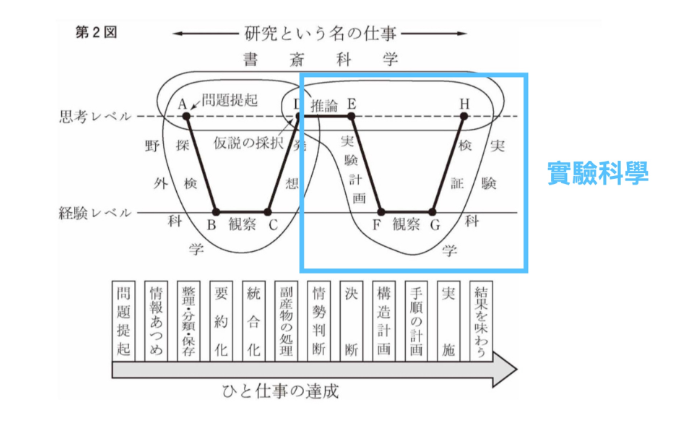

打造超人笔记这本书，结构与内容上都会比前几本作品更来的轻与精炼。

主要是笔记这个看起来复杂的议题，其实远比学习与读书这两个问题来的简单。

拆开流程以后，主问题结构变得非常简单。

甚至笔记这个领域最大的难题「快速记录工具」、「笔记整理软体」，到了 2020 后，许多外星科技陆续的被发明出来。

经过上一章我的拆解示范之后，各位读者甚至会有种「什么，这问题就这么简单，我怎么当初会被困扰这么久」的错愕感。

有了这些工具，甚至在一般的情况，「笔记搜寻」这件事，都是个小事。

只要读者按照 [[03-1-提取：將線索變成資料]] 提及的方法，将线索经过

* 格式处理（转换成手机、电脑容易搜寻）
* 档案是使用日期序列方式排列
* 档案使用关键字连结
* 储放在云端服务上（如 Dropbox, Evernote）

几乎不存在打捞不回来的状况。

所以在本书里面的「搜寻」这一章，我想探讨一个超级难度的「搜寻」问题：如何透过做笔记、整理笔记，来挖掘整理出自己对一个领域想要的各种答案。

各位看完这段内容的拆解与示范，你也可以回家做到类似的成就！

## 做研究最难的问题：如何定义问题且找到方向与答案

在一般情况，我们做笔记，面对的都是纪录已知的资讯，然后试着去整理出一些在结构上我们能够理解的资讯去做内化。

但有时候，我们在做研究时，有时候想要研究的难题，我们甚至不知道如何定义问题。所以根本不知道怎么样找资料！

书读了一大堆，怎么样画线，也从过去的资料里面找不到符合的答案。这种状况很是令人困扰。

比如说：甚至就像本书的主题：如何做笔记、能够又轻松又省力、随时可以找到过去记录的东西，看到旧笔记时时能够轻松理解，而且想要取用时就可以立刻混搭应用。

这个难题本身就可以算世界难题了吧？当初我在做本书前身读书会的内容时，每个人都觉得这个题目是不可能被解掉的阿！

但是经过上一章的示范。我相信各位看到一定下巴掉下来，这个问题的答案怎么这么简单。原来这么难的问题，只要做几轮干坤大挪移，就解决了。简单到令人震惊，这是怎么做到了？

## 对问题的结构重新组织

在我的研究中，我认为绝大多数人都存在一个误区：他们认为所有问题的答案都可以在书本中找到。只要够勤奋，答案一定就在那里等待被发现。

然而，这种想法并不完全正确。

确实，历史上保存了很多有用的经验。但是，在我们需要寻找答案的领域中，有些问题的经验甚至还未被解开过，因此根本没有答案可供我们参考。

过去，我曾尝试解决这个难题，发明了一种逆向法（详见《打造超人大脑》与《打造超人思维》），即先设定目标，再从各个散落的抱怨中逆向找出真正的症结，一一克服难题，再重新整理出一套更高效的解题顺序。

使用这种方法的原因是，通过这种方式，我能够捕捉到实现目标中间的所有障碍，并将它们转化为相对明确的问题。通过将问题粗略分类，并将其拆分成细节，将单一大问题拆分成足够细的小问题，细化到足以进行类比，并在一般领域中找到类似但明确的答案。然后，通过排列组合，找到更有效率的执行路径，从而创造出新的答案。

这套方法是我在无数个专案执行和知识粹炼的过程中逐渐归纳出来的。

### 田野调查高效笔记法 - KJ 法

但这套方法，也因为我是无师自通的，我也不知道如何改进的更有效率。我十分希望过去已有先进，发明过类似的方法，这样我就可以加以参考并且修正。

在过去几年中，我使用类似的关键词在亚马逊上搜寻，但都没有收获。直到去年，当我研究知识产出的议题时，我才发现一个类似的方法：田野调查专家川喜田二郎于1967年提出的KJ法（其名称来源于他的姓名缩写），该方法与我的逆向法非常相似。

这套 KJ 法的解题顺序，也是

* 首先提出许多问题
* 将问题分类
* 将问题各个击破，挖掘到最后找到问题的根本解答。

而当时，川喜田二郎为什么当初要提出这套做学问的方法呢？

### 书斋科学、实验科学、田野科学

川喜田二郎提出这样一个观点：他认为这世界上所谓的「科学」，实质上还更细分为三种科学。

* 书斋科学
* 实验科学
* 田野科学

什么是书斋科学？

大多数我们所学习的学问，往往都是来自于书斋科学。这些学问很大一部分是由所谓的学者整理而来，但并没有经过验证。他们自己提出一个问题，然后在书中找到一个主观的答案，最后组织成读书笔记。

这些学问看似很有道理，但多数无法经过推敲。这也是为什么有些学问看似正确，但实际上却很难被证实的原因。书斋科学也是当今学术界有些理论根本经不起推敲与重现的原因。

因此，书斋科学往往只是直接“问题提起”，然后“推论”下去的结果。

### 实验科学

实验科学是我们在实验室里学习的科学。它是可重复、可证伪的。但实验科学的起点往往是一个推论，由一个推论在无污染的实验室中进行，最后得到一个在实验室可验证的结果。但是，回放到原始的领域，这些实验的结果无法重现或只能部分重现，或者无法解释原先领域的真正问题。

### 田野问题

而川喜田二郎所在的领域是社会科学。社会科学的特点是

* 通常没有前书可以推论
* 也很难在实验室里面重现结果（因为没有办法创造出无尘环境）

但田野科学最困难的是如何定义最初的问题。其实，不仅社会科学面临这样的挑战，世界上大多数领域都面临着同样的问题：

* 什么才是真正的问题？
* 我们又如何挖掘出真正的关键并解决
* 并且把关键点解开重新排序成为真正的概念方法
* 这些概念与方法还要是可重复可证伪且放诸四海皆准的

因此，川喜田二郎提出了这样的解题方法：

因此，川喜田二郎提出了这样的解题方法：先大量搜集资讯以及目前环境中浮现的问题，用索引卡片搜集起来，经过一定的整理和分类，对卡片上的问题找到合理的流程与公式，最后一个一个攻破，找到更高效的答案后，整合在一起。经过大量的筛选之后，这样产出的最终结论甚至会颠覆原有领域直觉的答案。

我相信，在阅读《打造超人笔记》这本书之前，很多读者可能无法想象笔记可以这样整理，也必须这样整理：

* 原来我们的大脑设计无法应付一边记录一边整理。
* 原来我们花费大量精力整理的笔记，很多时候，根本无法重新再利用。
* 每次我们整理笔记，从入门到放弃，是因为我们先归纳再总结，而不是先总结再归纳。

## 透过逆向法 + 问题节点，重新归纳类比，破解笔记难题

看到这里，各位读者应该会知道，这本书的内容是怎么粹练出来的。

我正是用用这套方法 + 卡片笔记法 + 笔记软体 Logseq 做出来的。

当时，我原本开读书会的初衷，是想要分享 Logseq 这套软体如何使用的。于是做了一个读书会的问卷调查表单，结果没想到想参加的人，关于读书会的问题，全部都不是关于工具上的，而是对笔记这门学问，真真确确存在很多基础却也相当严重的入门即绊倒的难题。

于是收到这一百多个问题后，我就先将这些问题，一条一条贴进笔记软体内，然后再为它们打上 TAG。经过打了一两轮 TAG 后，我发现这些问题，主要具拢在五大难题上：

* 纪录
* 提取
* 整理
* 搜寻
* 应用

在这五个类别下，各有大概十数条难题。有些难题是我曾经解决过的，有些则是我没有碰过，但稍微搜索一下，可能就可以找到当今世界上已有的答案。

耐心地回答完这些问题后，我发现笔记世界中 90% 的问题都被我解决了。

此外，为了整理读书会的投影，我为了转述比喻一些形象的概念，做着做着竟然也整理出了让我自己也感觉非常经典的观点，例如「总结与归纳」、「打猎切肉」的神奇误区。

如果读者本身是研究者，如果你要进行新领域的挑战，或者要展开新领域、新兴趣的挑战，不妨用这个方法尝试一下。它很有可能会产生令人惊喜的结果。
