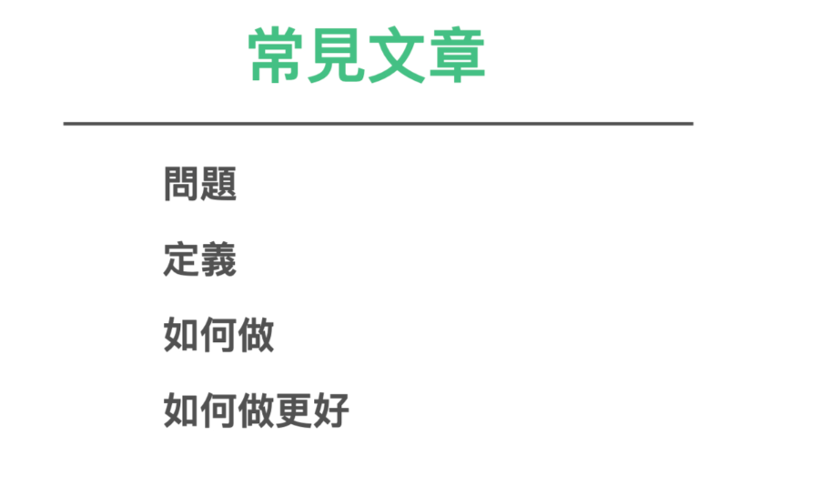
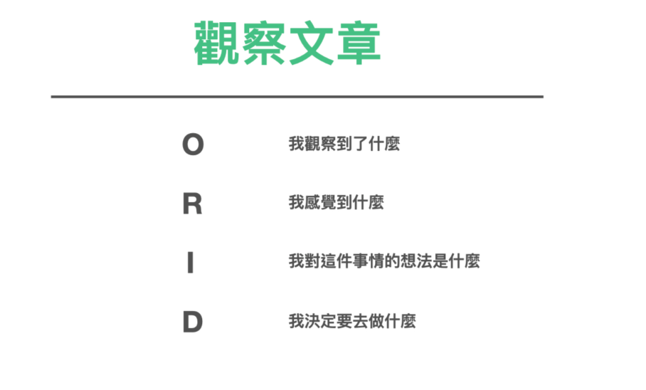
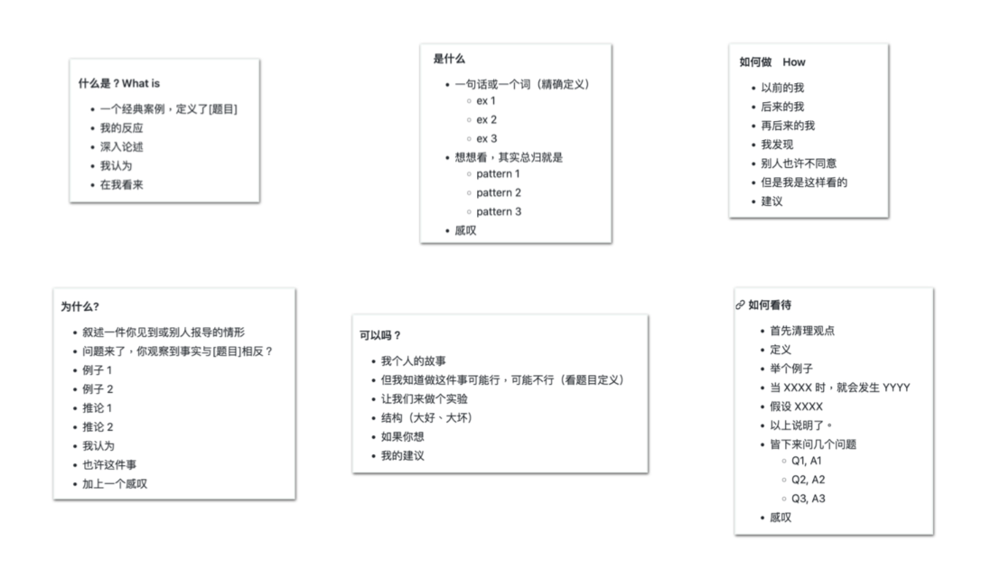

影音、文章是资讯消化后的产出最后形式。

如何有源源不决的素材写文章呢？

我有两种基本格式的文章可以推荐给大家。这也是非常适合储存直接做为终点笔记卡片模版的结构。

### 实做笔记

1. 点出问题
2. 定义这个问题
3. 叙述流程
4. 怎么样把这件事做到更好

当一个问题经过组织消化，在你的笔记软体内，可能就自己已经有这样的答案了。

### ORID 观察笔记

又或者只是单纯的观察、感想笔记

ORID 即是

1.  O-“Objective”：观察外在客观、事实。了解客观事实的问句如下：

-   看到了什么？
-   记得什么？
-   发生了什么事？

2.  R-“Reflective”：重视内在感受、反应。唤起情绪与感受的问句如下：

-   有什么地方让你很感动/惊讶/难过/开心？
-   什么是你觉得比较困难/容易/处理的？
-   令你觉得印象深刻的地方？

3.  I-“Interpretive”：诠释意义、价值、经验。寻找前述意义与价值的问句如下：

-   为什么这些让你很感动/惊讶/难过/开心？
-   引发你想到了什么？有什么重要的领悟吗？
-   对你而言，重要的意义是什么？学到了什么？

4.  D-“Decisional”：找出决定、行动。找出决议和行动的问句如下：

-   有什么我们可以改变的地方？
-   接下来的行动/计划会是什么？
-   还需要什么资源或支持才能完成目标？
-   未来你要如何应用？

### 知乎热门文章的六种类型

这六个结构，我是剖析过知乎超过一千篇千赞文章，所找出来的文章结构。

千赞文章列表 [https://zhuanlan.zhihu.com/p/67447763](https://zhuanlan.zhihu.com/p/67447763)

#### 如何做　How

-   以前的我
-   后来的我
-   再后来的我
-   我发现
-   别人也许不同意
-   但是我是这样看的
-   建议

要怎样努力，才能成为很厉害的人？ - 朱炫的回答 - 知乎 [https://www.zhihu.com/question/22921426/answer/23330366](https://www.zhihu.com/question/22921426/answer/23330366)

体质极差的人该如何从头开始恢复身体素质？ [https://www.zhihu.com/question/20381470](https://www.zhihu.com/question/20381470)

如何与父母断绝亲子关系？ - 莊謙的回答 - 知乎 [https://www.zhihu.com/question/22561592/answer/23108777](https://www.zhihu.com/question/22561592/answer/23108777)

#### 为什么?

-   叙述一件你见到或别人报导的情形
-   问题来了，你观察到事实与[题目]相反？
-   例子 1
-   例子 2
-   推论 1
-   推论 2
-   我认为
-   也许这件事
-   加上一个感叹

为什么中国男足踢不好？ [https://www.zhihu.com/question/21223279/answer/27324884](https://www.zhihu.com/question/21223279/answer/27324884)

#### 什么是？What is

-   一个经典案例，定义了[题目]
-   我的反应
-   深入论述
-   我认为
-   在我看来

什么是爱？爱一个人是什么感觉？ - 盐选推荐的回答 - 知乎 [https://www.zhihu.com/question/20875474/answer/815365170](https://www.zhihu.com/question/20875474/answer/815365170)

#### 如何看待

-   首先清理观点
-   定义
-   举个例子
-   当 XXXX 时，就会发生 YYYY
-   假设 XXXX
-   以上说明了。
-   皆下来问几个问题
    -   Q1, A1
    -   Q2, A2
    -   Q3, A3
-   感叹

如何看待抵制B站的宣传片《后浪》的行为？ - BLUE的回答 - 知乎 [https://www.zhihu.com/question/392763695/answer/1202122234](https://www.zhihu.com/question/392763695/answer/1202122234)

#### 是什么

-   一句话或一个词（精确定义）
    -   ex 1
    -   ex 2
    -   ex 3
-   想想看，其实总归就是
    -   pattern 1
    -   pattern 2
    -   pattern 3
-   感叹

男女交往中男性的核心竞争力是什么？ - ccc zhao的回答 - 知乎 [https://www.zhihu.com/question/23513628/answer/24826186](https://www.zhihu.com/question/23513628/answer/24826186)

#### 可以吗？

-   我个人的故事
-   但我知道做这件事可能行，可能不行（看题目定义）
-   让我们来做个实验
-   结构（大好、大坏）
-   如果你想
-   我的建议

美国那种完全不喝水，只喝含糖饮料、啤酒或牛奶的人，健康会出问题吗？ - 丫丫奶昔的回答 - 知乎 [https://www.zhihu.com/question/396124015/answer/1236574232](https://www.zhihu.com/question/396124015/answer/1236574232)