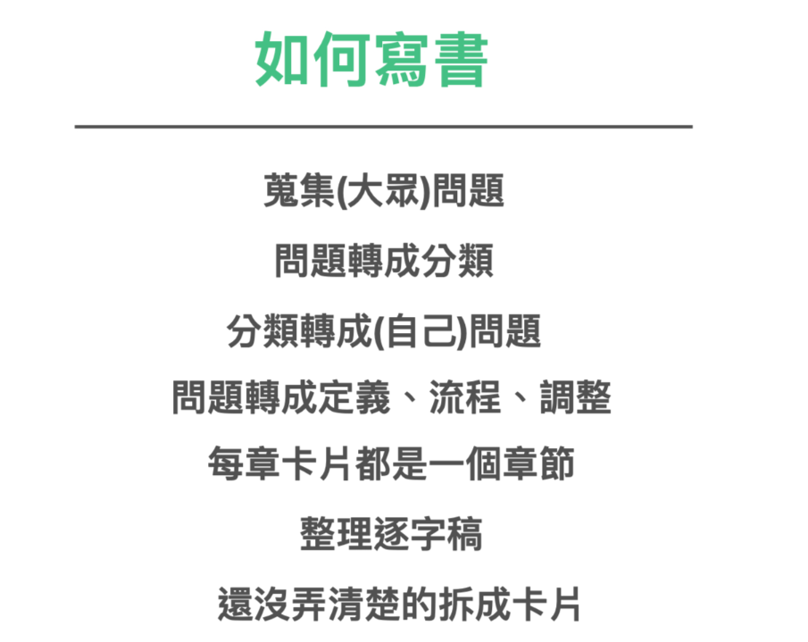
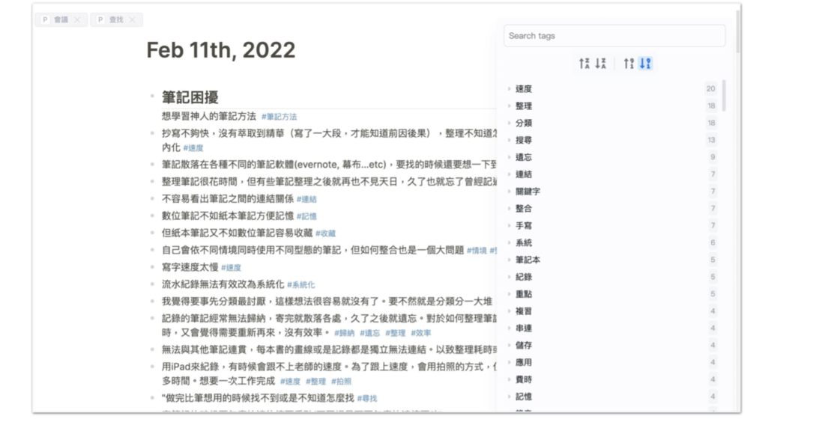
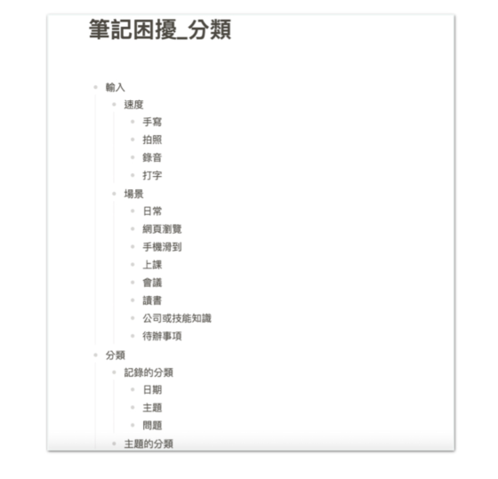
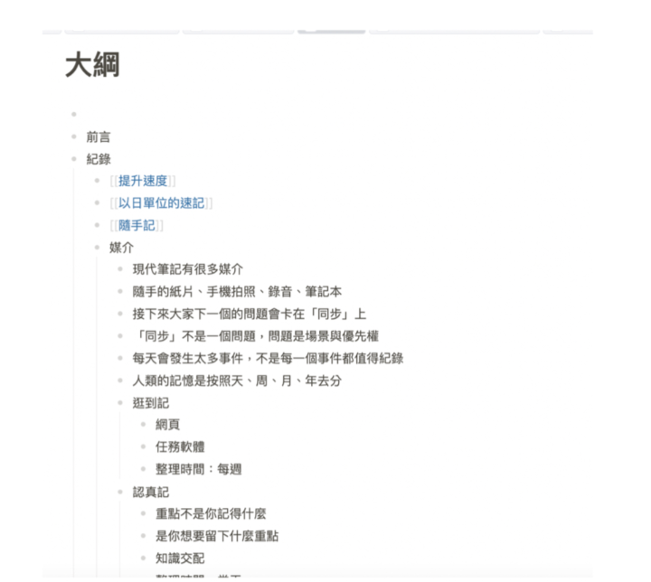
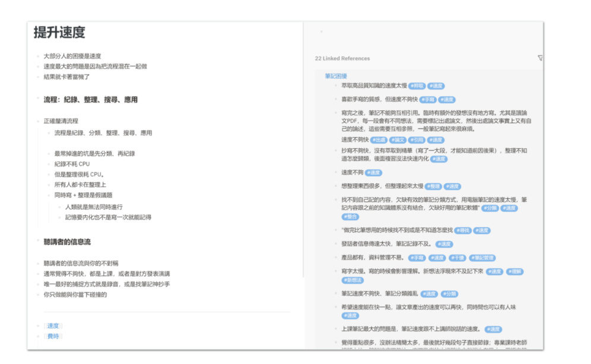

我在打造超人大脑中有略微提及如何写书的作法。这里将以「打造超人笔记」这本书示范如何更高效的完成一本书。

## Step 1: 先将所有的问题搜集贴上，并打上 TAG

我先使用问卷，搜集大家五花八门各式各样奇怪的问题。

## 2. 安装 Tag 外挂，然后统计最前面几名的分类

然后再使用 TAG 功能，粗步将这一些问题进行第一遍的分类。

## 3. 从前几名的 TAG ，找到有意义的分类

再将第一次的分类，收拢之后归纳成一个为五步骤的流程。

### 复制后另开一篇为大纲的笔记

这个五步骤流程，就成了这一本书的大纲。

### 针对这些题目展开写详细大纲，若大纲太长则切割为写作卡片

我再展开大纲，每一个大纲的标题，都展开写上 5-10 句，我对这个事情的感想。

## 5. 使用笔记内的 TAG 找到相关困扰，一边整理关键标题

等感想大致写完。我再看着这 5-10 句的感想线索、搭配原先问题的关键字，重写成一篇的文章。

而这些文章就会变成一篇一篇有效的资讯。

### 6. 重新整理成书籍章节

等到我重新重写了这 80% 的文章稿。（这通常是第一遍书稿）

我就会进行二次三次的整理。

也许是将所有的内容做成一份更直观的投影片，透过整理投影片的过程，让整个内容可以有更立体的浓缩与对比。

又或者是直接重写成书籍的章节结构，重新调整安排内部的内容比重。

